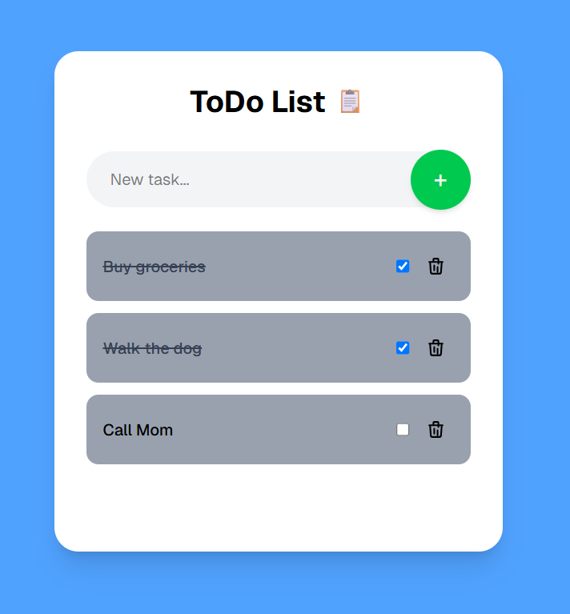

# TypeScript Task List 📋

A simple to-do list web app built with **Next.js**, **React**, **TypeScript** and **Tailwind CSS**. I created it as a hands-on project to learn TypeScript and the Next.js App Router, including how to build a small REST API and connect it to a React frontend.



## Features

- Add new tasks
- Mark tasks as completed (with strike-through styling)
- Delete tasks
- Tasks are persisted between sessions in a local JSON file
- Optimistic UI updates: the interface updates immediately and rolls back if the server request fails (on toggle)
- Responsive layout styled with Tailwind CSS

## Tech Stack

| Area      | Technology                          |
| --------- | ----------------------------------- |
| Framework | Next.js                             |
| UI        | React                               |
| Language  | TypeScript                          |
| Styling   | Tailwind                            |
| Backend   | Next.js Route Handlers (REST API)   |
| Storage   | Local JSON file (`data/tasks.json`) |
| Linting   | ESLint                              |

## Getting Started

**Prerequisites:** Node.js 20 or later

```bash
# Clone the repository
git clone https://github.com/Ludovico02/typescript-task-list.git
cd typescript-task-list

# Install dependencies
npm install

# Start the development server
npm run dev
```

Then open [http://localhost:3000](http://localhost:3000) in your browser.

Other scripts:

```bash
npm run build   # Create a production build
npm start       # Run the production build
npm run lint    # Lint the code
```

## Project Structure

```
app/
├── api/tasks/route.ts      # REST API: GET, POST, PUT, DELETE
├── components/
│   ├── AddTaskButton.tsx   # Input + button to create a task
│   ├── Task.tsx            # Single task row (checkbox + delete)
│   └── TaskList.tsx        # Renders the list of tasks
├── pages/TasksHome.tsx     # Main client component: state and API calls
├── layout.tsx
└── page.tsx
data/
└── tasks.json              # Persistent storage
```

## API

All endpoints live at `/api/tasks`.

| Method   | Description                  | Body / Params              |
| -------- | ---------------------------- | -------------------------- |
| `GET`    | Get all tasks                | none                       |
| `POST`   | Create a task                | `{ "name": string }`       |
| `PUT`    | Update an existing task      | `{ id, name, status }`     |
| `DELETE` | Delete a task                | query param `?id=<number>` |

## What I Learned

- Typing React props and state with TypeScript interfaces
- Structuring a Next.js App Router project (server vs. client components)
- Building REST endpoints with Route Handlers
- Reading and writing data with Node's `fs/promises`
- Managing state with hooks (`useState`, `useEffect`) and optimistic updates
- Styling with Tailwind CSS utility classes

## Known Limitations & Possible Improvements

This was a learning project, so there are a few things I would do differently today:

- Storage is a local JSON file, which works locally but not on serverless platforms like Vercel. A real database (e.g. SQLite or PostgreSQL) would be the next step.
- Replace the remaining `any` types with a shared `Task` interface
- Add input validation and consistent error handling on the API
- Add automated tests
- Add task editing, filtering (all / active / completed) and due dates
